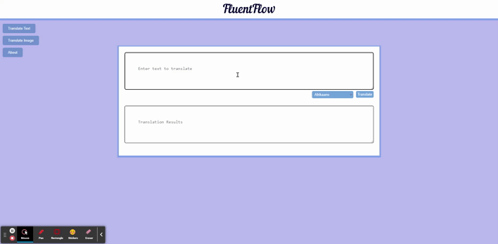
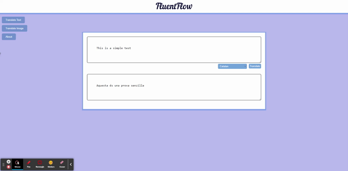

# FluentFlow: Effortless Translation for Text and Images

FluentFlow is a powerful and versatile translation application that seamlessly integrates text translation with OCR capabilities, enabling you to translate both text and images into a wide range of languages. It's designed for smooth user experience, efficient translation, and convenient caching for faster translation retrieval.
**Deployment Status**: [https://adewale.tech/translate](https://adewale.tech/translate)

## Table of Contents

* [FluentFlow: Effortless Translation for Text and Images](#fluentflow-effortless-translation-for-text-and-images)
* [Core Features](#core-features)
* [Building Blocks](#building-blocks)
* [Installation](#installation)
* [Usage](#usage)
* [Contributing](#contributing)
* [AUTHORS](#authors)
* [Licensing](#licensing)
* [Related Projects](#related-projects)

## Core Features

* **Image Translation:** Extract text from images and translate it into your chosen language using OCR technology.
* **Text Translation:** Convert text directly into another language through text input method.
* **Extensive Language Support:** Translate content between a comprehensive list of languages.
* **Caching:** Store translated content for faster retrieval.
* **User-Friendly Interface:** Provide an intuitive and user-friendly interface for easy navigation and interaction.
* **API Integration:** Leverage powerful translation capabilities from Google Cloud Translate to deliver accurate translations.

## Building Blocks

FluentFlow is built upon a foundation of well-established libraries and technologies:

* **Programming Language**: Python 3
* **Front-End Technologies**:
* **HTML**: Provides the fundamental structure and content of the web application.
* **CSS**: Responsible for styling the web page's visual elements, ensuring user-friendliness and aesthetics.
* **JavaScript(JQuery)**: Adds interactivity and dynamic behavior to the web application, enabling user interaction and data manipulation.
* **OCR Library**: [OCR-Space](https://ocr.space/OCRAPI)
* **Translation Library**: [Google Cloud Translate API](https://cloud.google.com/translate)
* **Database**: MySQL
* **ORM**: SQLAlchemy (Object-Relational Mapper for database interaction)
* **Web Framework**: Flask

## Installation

No installation is required.

## Usage

To use FluentFlow, Visit our [Application Page](http://adewale.tech/translate)

* **Text Translation:**
  * Enter text to translate in the top box
  * Select target language from dropdown
  * Click translate button and wait a few seconds for translation result
  

* **Image Translation:**
  * Click 'Translate_Image'
  * Click 'Click to upload image' - preview of selected image will be shown
  * Select language from dropdown.
  * Click translate button and wait a few seconds for translation result
  

## Contributing

We appreciate contributions from the community! If you're interested in helping improve FluentFlow, here's how you can get involved:

**Getting Started:**

* Make sure you have Python 3 and Git installed on your system.
* Fork the repository on GitHub.
* Clone your forked repository to your local machine.

**Contribution Guidelines:**

* **Issue Tracking:** Report bugs or suggest features by creating an issue on the GitHub repository.
* **Pull Requests:** All code changes should be submitted via pull requests. Please follow these steps:
    1. Create a new branch for your changes.
    2. Implement your changes and add relevant tests (if applicable).
    3. Ensure your code adheres to any style guidelines.
    4. Submit a pull request with a clear description of your changes.

**Thank you for your interest in contributing!**

## Licensing

This project is licensed under the MIT License. See the [LICENSE](LICENSE.md) file for details.

## AUTHORS

* Abdulrazzaq Adewale Liasu (backend)
* Oluwatosin Salami (frontend)

## Related Projects
This list is a work in progress. We welcome contributions from the community! If you've found other projects that complement FluentFlow, please submit a pull request to add them to this list.

* **Google Translate API**: A powerful cloud-based translation service offering support for a wide range of languages. (Link to Google Cloud Translate API documentation)
* **DeepL Translator**: A popular online translation tool known for its high accuracy and nuanced translations. (Link to DeepL website)
* **Tesseract OCR**: An open-source optical character recognition (OCR) engine that can be used to extract text from images. (Link to Tesseract OCR website)
